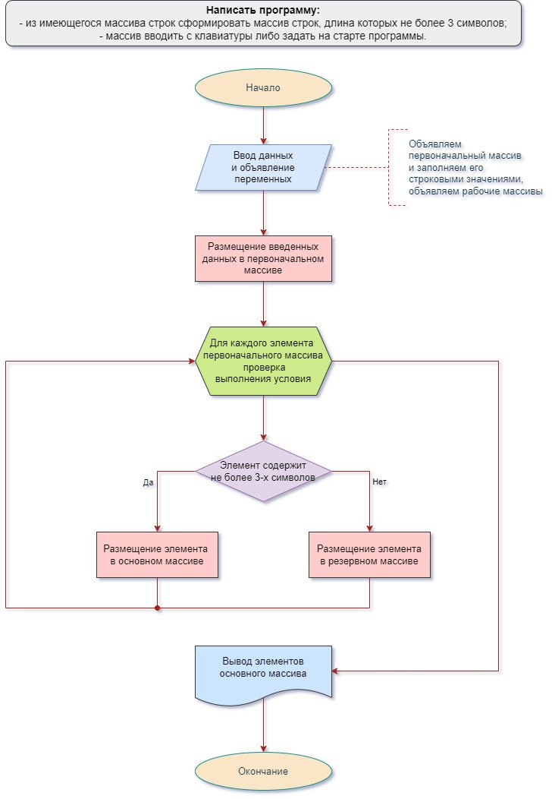

# Контрольная работа.

## Задание. 
Написать программу, которая из имеющегося массива строк формирует другой массив строк, длина которых не превышает 3-х символов;
Первоначальный массив можно вводить с клавиатуры или задать на старте программы;

## Алгоритм выполнения программы состоит из следующих блоков:

### 1. Объявление переменных.
Тип основных переменных *string*, вспомогательные переменные *int* и *var*.

### 2. Ввод данных одной строкой.
Пользователь может выбрать варианты ввода - с клавиатуры (одной строкой) или тестовый ввод (строка находится в коде).

### 3. Разбиенте данных на элементы массива.
Разбиение данных на отдельные элементы производится по результатам выбора варианта ввода и последующего ввода, если выбран ввод с клавиатуры. В этом случае Пользователю необходимо выбрать вариант разделителя.

### 4. Проверка каждого элемента массива на выполнение условия
Пользователь задает число символов, по которому необходимо проводить отбор элементов. По умолчанию для работы с тестовой строкой максимальное число символов, удовлетворяющее условию, равно 3. Для каждого элемента первоначального массива производится проверка истинности условия - число символов 
не превышает установленной границы. Cтрока состоящая из пробела не удовлетворяет условию. 

### 5. Формирование рабочих массивов. 
В результате сравнения с условиями отбора все элементы первоначального массива распределяются на два рабочих массива: элементы, удовлетворяющие условию, размещаются в основной массив, а элементы, не удовлетворяющие условию отбора, - в резервный массив.

### 6. Вывод элементов в соответствии с результатами отбора.
Пользователю выводятся два массива: основной - для дальнейшего использования, резервный - для контроля правильности отбора. Перед выводом информации длина каждого массива корректируется
в соответствии с количеством элементов, переданных в каждый из них по результатам сравнения с условием отбора.

## Приложения:
1. Задание 
2. Алгоритм 

Исполнитель: Рюмин А.Г., группа 3742